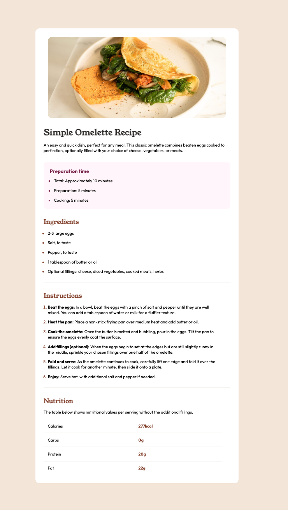

# Frontend Mentor's Recipe Page Challenge
## Overview 
This repository is my attempt to reproduce the design of Frontend Mentor's Recipe Page challenge, found [here](https://www.frontendmentor.io/challenges/recipe-page-KiTsR8QQKm).  As a "Newbie" challenge, it only requires HTML and CSS to complete.  While the design contains many of the same characteristics of the other "Newbie" challenges that I completed, it was a longer text than any of the other designs that I completed, and I tried to focus on using proper semantic HTML as I worked through the design.
## Used In Project
* HTML
* CSS
## Challenges
Probably the hardest part of this project was figuring out how to create proper separation between the small components within the ordered and unordered lists, and creating the right borders around the table elements (without adding a final line at the bottom of the table).  Yet, this wasn't a particularly difficult challenge, after completing a number of similar challenges.
## Completed Project
The completed project has been published as a [Github Page](https://grimmaldi.github.io/fe-mentors-recipe-page/).  I have also taken a screenshot of the finished design, though, because of the amount of content, this is not the best way to see it:
